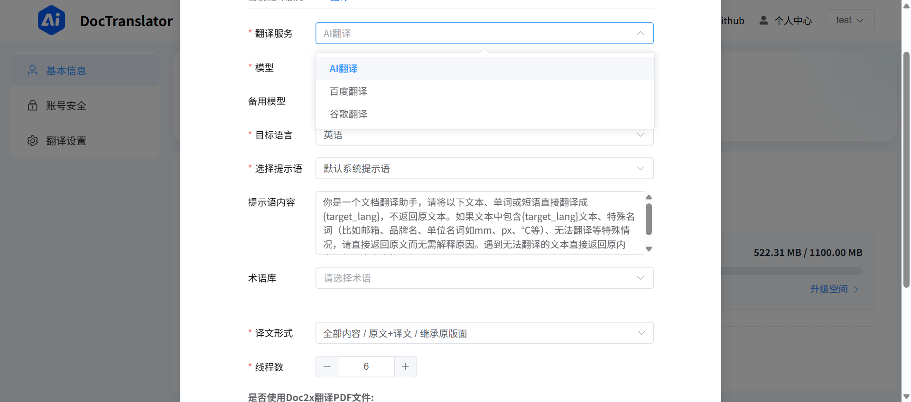

🎉 **DocTranslator Pro 版本现已发布！** 欢迎体验，功能更强大！

## ✨ Pro 版本核心优势

- **智能分块策略**: 能更好地识别段落、列表等结构，提升翻译质量与上下文连贯性。
- **成本优化**: 通过更高效的提示词设计和注入策略，显著减少 Token 消耗，有效降低翻译成本。
- **术语库**: 支持用户定义术语对照表，确保专业术语翻译的准确性和一致性。
- **翻译记忆库**: 智能复用历史翻译，提升效率、降低成本。
- **AI模型服务商管理**: 可配置 OpenAI, Qwen, DeepSeek 等多种大模型，用户可根据需求选择或由系统智能路由。
- **批量处理**: 支持文档上传选择多个术语库和翻译记忆，并发翻译，处理效率更高更准确。
- **消耗统计**: 提供Token消耗统计等管理后台功能。

[](https://pro.doctranslator.cn)  

---

# 📄 DocTranslator - 文档 AI 翻译工具 🚀

**DocTranslator** 文档翻译，支持多种文件格式的翻译，兼容 OpenAI 格式的 API，并支持批量操作和多线程处理。无论是个人用户还是企业团队，DocTranslator 都能帮助你高效完成文档翻译任务！✨

[[English]](README_en.md)

---


| 🌐 **在线体验**     | [立即访问](https://dc.starpms.cn/) |
|:--------------------:|:----------------------------------:|
| 📚 **官方文档**     | [查看文档](https://www.doctranslator.cn/)      |
| 👉 **推荐API中转站**    | [立即使用](https://www.ezworkapi.com)     |


[🔥GPT中转站推荐-低价优惠-点击此处跳转🔥](https://www.ezworkapi.com) 

---

## 🌟 功能特性

- **支持多种文档格式**  
  📑 **txt**、📝 **markdown**、📄 **word**、📊 **csv**、📈 **excel**、📑 **pdf(非扫描版)**、📽️ **ppt** 文档的 AI 翻译。
  

- **兼容 OpenAI 格式的 API**  
  🤖 支持任何符合 OpenAI 格式的端点 API（中转 API），灵活适配多种 AI 模型。

- **批量操作**  
  🚀 支持批量上传和翻译文档，提升工作效率。

- **多线程支持**  
  ⚡ 利用多线程技术，加速文档翻译过程。

- **Docker 部署**  
  🐳 支持 Docker 一键部署，简单易用。

---

## 🛠️ 技术栈

- **前端**：Vue 3 + Vite  
- **后端**：Python + Flask+MySQL/SQLite  
- **AI 翻译**：兼容 OpenAI 格式 
- **部署**：Docker + Nginx  

---

## 效果如图:
### 用户端页面演示




### 管理端页面演示


## 一键部署
```bash

git clone https://github.com/mingchen666/DocTranslator.git
cd DocTranslator

# 2. 配置后端环境变量 (重要！)
cp backend/.env.example backend/.env
# 然后编辑 backend/.env 文件，填写数据库等信息

# 3. 一键部署
chmod +x deploy.sh && ./deploy.sh

```


## 🚀 本地开发

### 1. 克隆项目

```bash
git clone https://github.com/mingchen666/DocTranslator.git
cd DocTranslator
```

### 2. 配置环境变量

在 `backend/.env` 文件中填写必要的环境变量


### 3. 启动后端

进入后端目录安装依赖：

```bash
cd backend
pip install -r requirements.txt
```

### 4. 启动后端

```bash
python app.py
```

### 5. 启动前端和管理端
> **/dist 文件夹已经是打包好了的，直接部署使用即可，不本地开发可以忽略下面步骤**
>

*前端*

```bash
cd frontend
pnpm install
pnpm dev
```

*管理端*

```bash
cd admin
pnpm install
pnpm dev
```


### 6. 访问项目

- **前端**：http://localhost:1475  
- **管理端**：http://localhost:8081  
- **后端 API**：http://localhost:5000  

---


## 🐳 一、Docker 部署（在线镜像beta版本）

### 1. 创建 Docker 网络

```bash
docker network create my-network
```

### 2. 运行后端容器

```bash
cd ..
docker run -d \
  --name backend-container \
  --network my-network \
  -p 5000:5000 \
  -v $(pwd)/backend/db:/app/db \
  eggsunsky/doctranslator:latest
```
### 3. 启动 Nginx

```bash
docker run -d \
  --name nginx-container \
  -p 1475:80 \
  -p 8081:8081 \
  -v $(pwd)/nginx/nginx.conf:/etc/nginx/conf.d/default.conf \
  -v $(pwd)/frontend/dist:/usr/share/nginx/html/frontend \
  -v $(pwd)/admin/dist:/usr/share/nginx/html/admin \
  --network my-network \
  nginx:stable-alpine
```

### 4. 访问服务

- **前端**：http://localhost:1475  
- **管理端**：http://localhost:8081  
- **后端 API**：http://localhost:5000 

## 🐳 二、Docker 部署（自行构建镜像）

### 1. 项目结构

```plaintext
DocTranslator/
├── frontend/          # 前端代码
├── admin/             # 管理员端代码
├── backend/           # 后端代码
├── nginx/             # Nginx 配置
│   └── nginx.conf     # Nginx 配置文件
```

### 2. 创建 Docker 网络

```bash
docker network create my-network
```

### 3. 后端部署

#### 3.1 配置环境变量

确保 `DocTranslator/backend/.env` 文件已正确填写环境变量。

#### 3.2 构建后端镜像

```bash
cd DocTranslator/backend
docker build -t doctranslator .
```

#### 3.3 运行后端容器

```bash
cd ..
docker run -d \
  --name backend-container \
  --network my-network \
  -p 5000:5000 \
  -v $(pwd)/backend/db:/app/db \
  doctranslator
```

### 4. 启动 Nginx

```bash
docker run -d \
  --name nginx-container \
  -p 1475:80 \
  -p 8081:8081 \
  -v $(pwd)/nginx/nginx.conf:/etc/nginx/conf.d/default.conf \
  -v $(pwd)/frontend/dist:/usr/share/nginx/html/frontend \
  -v $(pwd)/admin/dist:/usr/share/nginx/html/admin \
  --network my-network \
  nginx:stable-alpine
```

### 5. 访问服务

- **前端**：http://localhost:1475  
- **管理端**：http://localhost:8081  
- **后端 API**：http://localhost:5000  
  - *账号*：admin ; *密码*：123456

---

## 🐳 三、Docker-Compose 部署（自行构建镜像）
###  启动项目
```shell
cd DocTranslator
docker-compose up -d
```

### 更新项目
```shell
cd /DocTranslator
docker compose down
git pull
docker compose pull
docker compose up -d
```


## 💖 赞赏支持

维护此项目需要耗费大量精力，如果DocTranslator对你有帮助，欢迎赞赏支持！你的支持是我持续开发的动力！😊  

---

## 📢 交流群
有任何问题想交流，欢迎加入我们的交流群


## 🤝 贡献指南

欢迎贡献代码！

---

## 📜 许可

[Apache-2.0 license](LICENSE)

---


## 📞 联系我

如有任何问题或建议，请联系我：  
---

## 👋 关于我

在读生一枚，有点喜欢前端，喜欢探索AI应用和工具开发
🎉 感谢大家的支持！欢迎 Star ⭐️ 和 Fork 🍴，一起完善 DocTranslator！


## 📌 说明

本项目基于 [ezwork](https://github.com/EHEWON/ezwork-ai-doc-translation) 进行重构优化，感谢原作者的贡献！🙏

## 🙏 感谢

  [BabelDOC](https://github.com/funstory-ai/BabelDOC)

[](https://star-history.com/#mingchen666/DocTranslator)
